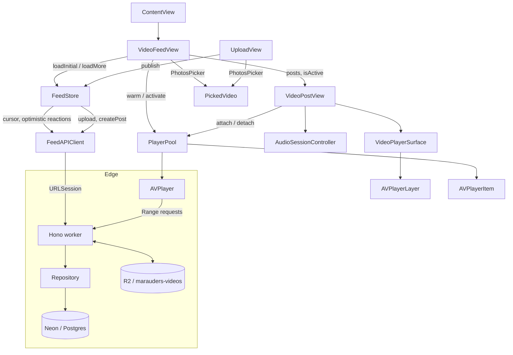

# Marauders

A short-form video feed for iOS with its own API, built with SwiftUI, AVFoundation,
Hono, Cloudflare Workers and Neon (Postgres).

The home tab is a vertical, full-screen video feed in the style of TikTok: swipe up
for the next clip, tap to pause, double tap to like. Likes and saves are written
through to the API optimistically and are scoped per viewer.

## Features

The home screen is the video and nothing else. There is no caption and no action rail; a clip
fills the screen and the only chrome is what playback itself needs. The tab bar is the single
exception: it exists to reach the upload tab, and nothing else is in it.

- Full bleed vertical paging, one clip per screen, snapping to the next
- Landscape clips are shown whole, floating over a blurred, dimmed copy of themselves so a
  16:9 video fills a 19.5:9 screen instead of being cropped to its middle 46 percent
- Tap to pause and resume, with a play glyph while paused, and press and hold to park the clip
  for as long as you keep your finger down. The progress hairline tracks the active clip
- Pooled `AVPlayer` instances that preload the neighbouring clips and stay mounted across a tab
  switch, so coming back resumes the same clip at the same position instead of reloading it
- A clip that ends moves the feed on rather than looping. The last clip wraps only if it played
  through to the end; if it is the tail and it cannot play, the feed says so instead of spinning
- The first frame of each clip is decoded and cached for the session, so a swipe shows a picture
  while the video buffers instead of a black rectangle and a spinner
- Buffering spinner and a feed level error state
- A clip that cannot play is skipped instead of shown: the feed jumps to the next playable post,
  pulling another page first if the failure landed on the tail. The failure card stays for
  anyone who scrolls back to a dead post on purpose
- Cursor based pagination that prefetches as the tail comes into view, plus an end of feed marker
- An "เพิ่ม" tab that picks a video from the phone, uploads it, creates the post and returns
  to the feed scrolled onto it. The clip is staged out of the photo library before the transfer,
  because the library's own file is temporary and can disappear the moment the picker call
  returns
- `AVAudioSession` on `.ambient` with `.mixWithOthers`: there is no mute button, so the
  hardware silent switch has to keep working and a clip must never stop other audio.
  The mode is `.default`, not `.moviePlayback`, which `AVAudioSession` only accepts alongside
  the `.playback` category. `PlayerPool` still handles interruptions and route changes

The API already carries likes, saves and comments, and `FeedStore` implements the optimistic
reaction flow, but none of it is on screen yet: playback is the thing being tuned first.

Every seeded post points at a stream that has been verified to actually decode. Two of the
five Apple sample streams that were in use fail with `CoreMediaErrorDomain -16044`, which is
why the feed was skipping its own first post on launch.

The production feed is intentionally empty: `npm run db:truncate` clears `posts`,
`post_likes` and `post_saves` and restarts the identity sequence, and the R2 objects go with
`npx wrangler r2 object delete marauders-videos/<key> --remote`. The app shows a "ยังไม่มีคลิป"
card until the first clip is uploaded, because a feed with zero posts is a normal state now
rather than a bug. `seed.sql` and `npm run db:seed` still bring the samples back for local work.

## Architecture



| Layer | Type | Responsibility |
| --- | --- | --- |
| `VideoFeedView` | View | Owns the feed state, decides which post is active, preloads a window of three |
| `VideoPostView` | View | One clip: the player surface, tap to pause, and the loading and failure states |
| `FeedStore` | `@Observable` class | Feed state machine: phases, cursor, optimistic reactions and rollback |
| `FeedAPIClient` | Struct | Typed `URLSession` calls, viewer identity and error mapping |
| `PlayerPool` | Plain class | Owns every `AVPlayer`, keyed by URL, with LRU eviction and pin protection |
| `VideoPlayerSurface` | `UIViewRepresentable` | Bridges `AVPlayer` into a view through a custom `AVPlayerLayer` host, with a selectable `videoGravity` |
| `AmbientVideoBackdrop` | `UIViewRepresentable` | Second `AVPlayerLayer` at `.resizeAspectFill` under a `UIVisualEffectView`, used as the blurred backdrop behind a letterboxed clip |
| `AudioSessionController` | Plain class | Single place that configures the shared `AVAudioSession` |
| `PickedVideo` | `Transferable` struct | Copies the picked clip out of the photo library onto a path this process owns |
| `UploadView` | View | The upload tab: picker, progress and error state for publishing a clip |
| `MultipartBody` | Struct | Encodes the clip as `multipart/form-data`; escapes the filename so it cannot forge a boundary |
| `repository.ts` | Module | Postgres queries: feed paging, reaction upserts, post creation, cursor encoding |
| `neon.ts` | Module | Adapts the Neon HTTP driver to the narrow `SqlClient` the repository talks to |
| `index.ts` | Hono app | Routing, viewer extraction, error handling |

## API

Base URL `http://127.0.0.1:8787`. Every request carries an `X-Viewer-Id` header, which
is what makes the reaction endpoints idempotent.

| Method | Path | Notes |
| --- | --- | --- |
| `GET` | `/api/health` | Liveness plus the seeded post count |
| `GET` | `/api/feed?cursor=&limit=` | Newest first, opaque cursor, `nextCursor` is null on the last page, `limit` defaults to 5 and is capped at 20 |
| `POST` | `/api/posts/:id/like` | Inserts into `post_likes`; increments only when the row is new |
| `DELETE` | `/api/posts/:id/like` | Deletes from `post_likes`; decrements only when a row was removed |
| `POST` | `/api/posts/:id/save` | Same contract for saves |
| `POST` | `/api/videos` | Multipart upload, field `video`; `mp4`, `mov` and `m4v` up to 64 MB. Requires `x-upload-token` |
| `GET` | `/api/videos/:key` | Streams a stored clip, honouring a single `Range` |
| `POST` | `/api/posts` | Creates a post from a URL this API stored. Requires `x-upload-token` |

The two write routes are gated by a shared secret; everything else is readable by anyone holding
the URL, which is what a feed is. Uploading and creating a post are separate calls, so a clip that
reaches the bucket but whose post fails can be retried without paying for the transfer again:

```bash
curl -X POST "$API/api/videos" -H "x-upload-token: $UPLOAD_TOKEN" \
  -F "video=@clip.mp4;type=video/mp4"
# {"key":"videos/<uuid>.mp4","url":"/api/videos/<uuid>.mp4","size":7340032}

curl -X POST "$API/api/posts" -H "x-upload-token: $UPLOAD_TOKEN" \
  -H 'content-type: application/json' \
  -d "{\"videoUrl\":\"$API/api/videos/<uuid>.mp4\",\"caption\":\"คลิปแรกของฉัน\"}"
```

The upload response returns a path rather than a bucket URL, so the client resolves it against
the API host before creating the post. `POST /api/posts` only accepts a `videoUrl` on
`/api/videos/`, which is what keeps the feed from being pointed at a third-party host.

Reaction responses are authoritative and always include the post's current counters and
the caller's own flags, so the client reconciles instead of guessing:

```json
{ "id": "hogsmeade-welcome", "likes": 128401, "saves": 9820, "isLiked": true, "isSaved": false }
```

Cursor values are base64 encoded sequence numbers. A malformed cursor is treated as the
start of the feed rather than an error.

## Video upload

Clips are stored in a private R2 bucket and streamed back through the Worker, so nothing has
to be publicly reachable for playback and the bucket is never a third-party dependency in a
post.

- Bucket: `marauders-videos`, bound to the Worker as `VIDEOS` via `[[r2_buckets]]` in
  `wrangler.toml`
- Keys are `videos/<uuid>.<ext>`, so nothing outside the prefix is ever addressable
- Limits are `MAX_UPLOAD_BYTES` (64 MB) and `ALLOWED_VIDEO_EXTENSIONS` in `src/types.ts`
- The body is written with `file.stream()` rather than a buffer, so a large clip does not have
  to fit in the isolate

The client re-encodes before it uploads. A phone clip arrives around 16 Mbit/s, which puts a 33
second clip at roughly 64 MB and the metadata atom at the end of the file, so a player has to fetch
the tail before it can start. `ClipTranscoder` rewrites the video at 6 Mbit/s, keeps the plain AAC
track, drops the ambisonic one, carries the rotation transform onto the output, and asks the writer
to lay the metadata out at the front. Measured on a 64 MB / 32 second clip, that is 25 MB, 37% of
the ceiling, in about four seconds of encode. The server side stays the same either way; this just
makes the clips smaller and streamable.

## Write access

`POST /api/videos` and `POST /api/posts` are the two routes that cost money or write rows, and
without a check anyone who learns the Worker URL can store 64MB objects in the bucket for as long
as they like. Both require an `x-upload-token` header matching the `UPLOAD_TOKEN` Worker secret:

```bash
wrangler secret put UPLOAD_TOKEN    # 32+ random bytes, e.g. `openssl rand -hex 32`
```

The same value goes in the app's `Config/Secrets.xcconfig`, which is gitignored:

```
MARAUDERS_UPLOAD_TOKEN = paste-the-token-here
```

`AppConfig.uploadToken` reads it back out of the bundle, so it never sits inline in the source.
`Config/Secrets.example.xcconfig` is the committed template.

How it behaves, all in `src/write-guard.ts`:

- The check runs before the body is parsed, so a rejected caller never gets a 64MB form read into
  the isolate on the way to a `401`
- A missing secret fails closed with `401 uploads_not_configured`; there is no state where writes
  are open because configuration was forgotten
- Comparison is length checked and non short circuiting, so a correct prefix does not pass and the
  timing does not leak how many characters were right
- `20` writes per `60s` per client address, then `429 rate_limited`. Unauthenticated attempts are
  not charged to the limit, so a flood cannot lock the real app out
- The counter lives in isolate memory, which makes it a floor rather than a hard cap: Workers do
  not share memory across instances. A hard global limit needs a Durable Object or KV

This is deliberately not user auth. A token inside an app binary is readable by anyone who
unzips it, so what it buys is that the URL alone is not enough; it is the right shape while the app
has no accounts, and it is not a substitute for accounts later.

A `Range` header is passed through to R2 and the resolved slice is turned back into
`Content-Range`, which is what lets `AVPlayer` seek without downloading the whole file. Only a
single range is honoured: answering the multipart `byteranges` form would mean prefixing each
part onto the body, and no media client asks for it. A malformed or unsatisfiable range is a
`416` rather than a silent full-body fallback.

The response status follows the request, not the shape of the result. R2 reports a range even
for a full read, so keying the `206` off `object.range` would turn every plain request into a
partial response.

## Design decisions

**`AVPlayerLayer` instead of `AVPlayerViewController`.** `AVPlayerViewController` brings its
own transport UI, PiP support and a `UIViewController` lifecycle that has to be re-hosted
inside SwiftUI. A custom `UIView` whose `layerClass` is `AVPlayerLayer` gives a plain SwiftUI
view, keeps the controls ours, and removes the `UIViewControllerRepresentable` hop. The cost is
that PiP, Now Playing info and DRM handling would have to be added back by hand.

**`ScrollView` with `.scrollTargetBehavior(.paging)` instead of a paged `TabView`.** A
`TabView` builds and keeps every page alive, which means every clip in the feed holds a
`VideoPlayerLayer` at once. A `LazyVStack` only materialises the pages near the viewport, and
`.containerRelativeFrame(.vertical)` plus paging gives one clip per screen without a fixed
height assumption.

**No side effects in `body`.** An early version resolved the player from inside `body`, which
mutated the pool during a view update. Player creation moved into `onAppear` / `onDisappear`,
so the view body stays a pure function of its inputs.

**Preloading is a side effect of pooling.** There is no separate preheat step: creating the
`AVPlayerItem` is what starts buffering, so warming the window is enough to hide the
manifest fetch of the next clip.

**Item status is observed, not guessed.** Each cell watches `AVPlayerItem.status` and
`AVPlayerItemFailedToPlayToEndTime`. The KVO callback can arrive off the main thread, so the
state change hops to the main actor before touching `@State`.

**Reactions are idempotent per viewer, not toggles.** `POST` means "I like this" and `DELETE`
means "I do not", keyed by `X-Viewer-Id`. Replaying a request cannot double count, which is
what makes the optimistic client safe to retry. The response carries the authoritative
counters so the client never has to increment locally after the round trip. The client keeps
the same split: an explicit "I like this" is dropped when the post is already liked, so
firing it twice can never unlike something.

**Rollback over reconciliation on failure.** A rejected like is restored to the snapshot
taken before the optimistic write, so a dropped connection cannot leave the UI showing a
like that the server never recorded.

**Postgres on Neon, reached over HTTP from the Worker.** The feed is a normal relational
schema, so a managed Postgres fits it better than an edge SQLite store, and the Neon HTTP
driver is a better fit for Workers than a TCP pooler. `DATABASE_URL` is a runtime secret, so
the same code runs locally, in preview and in production with no rebuild.

**A reaction is one statement per intent, inside a transaction.** The counter only moves when
the `post_likes` row actually changes:

```sql
WITH target AS (SELECT id FROM posts WHERE id = $2),
     written AS (INSERT INTO post_likes (viewer_id, post_id)
                 SELECT $1, id FROM target
                 ON CONFLICT DO NOTHING
                 RETURNING 1)
UPDATE posts SET likes = likes + 1
WHERE id IN (SELECT id FROM target) AND EXISTS (SELECT 1 FROM written)
```

Tying the `UPDATE` to `written` is what makes a replayed `POST` a no-op instead of a double
count, and `GREATEST(count - 1, 0)` stops a replayed `DELETE` from driving the counter
negative. The write and the read of the resulting counters are sent as a single
`transaction()` call, because a data-modifying CTE in one statement cannot see the rows the
same statement wrote: the read needs the transaction's next statement to see the new count.
`target` also makes an unknown post a clean no-op instead of a foreign key violation.

**The bucket stays private and the Worker is the only way in.** Clips are streamed back through
`/api/videos`, so playback needs nothing publicly reachable and the bucket never becomes a
third-party dependency inside a post. Storing the object with `file.stream()` rather than a
buffer means a large clip does not have to fit in the isolate.

**Uploading and creating a post are two calls, and the clip is staged before the first one.**
`PhotosPicker` hands back a file the photo library deletes as soon as the picker call returns,
so `PickedVideo` copies it onto a path this process owns during the transfer; reading it later
would race the library. Splitting the two API calls also means a post that fails to be created
can be retried without paying for the transfer again.

**The upload lives in a tab, not on the feed.** `VideoFeedView` owns every `AVPlayer` through
`PlayerPool` and is sized to the full paging container, so a picker and a progress state on top
of it would sit on the one surface that must stay distraction free. `ContentView` owns the
`FeedStore` and hands it to both tabs, so publishing inserts the post at the top of the feed
and the upload tab asks the feed to scroll onto it. Neither tab refetches.

**The write routes are gated before they cost anything.** `requireWriteAccess` runs ahead of the
form parse and the database lookup, so an unauthenticated caller is turned away without a 64MB
body being read into the isolate. A Worker with no `UPLOAD_TOKEN` refuses writes rather than
accepting them, which is the failure mode that matters: configuration forgotten on a fresh deploy
stops uploads instead of quietly opening the bucket.

**A post may only point at a clip this API stored.** `POST /api/posts` matches the URL path
against `/api/videos/` rather than trusting the origin, so a post cannot aim the feed at a
third-party host that would then learn who is watching. Because the bucket is private, that
path check covers both the relative URL the upload returns and the absolute form a client
builds from it.

**The response status follows the request, not the result.** R2 populates `object.range` even
for a full read, so deciding `206` from that field would turn every plain request into a partial
response. The route keys the status off whether a `Range` header actually arrived.

## Project layout

```
Marauders-ios/
  Config/Info.plist              ATS exception, and the upload token build setting
  Config/Secrets.example.xcconfig Template for the gitignored Secrets.xcconfig
  Marauders/
    ContentView.swift            Tab container
    MaraudersApp.swift           App entry point
    Friend.swift                 Friend model and sample data
    Feed/
      VideoFeedView.swift        Feed states, paging container, prefetch trigger
      VideoPostView.swift        One clip: player surface, tap to pause, error UI
      VideoPlayerSurface.swift   AVPlayerLayer bridge and the blurred backdrop
      PlayerPool.swift           Player cache, eviction, session events
      AudioSessionController.swift
      FeedStore.swift            Feed state machine, optimistic reactions, publishing
      FeedAPIClient.swift        URLSession client, viewer identity, errors, upload
      MultipartBody.swift        multipart/form-data encoder for the clip
      PickedVideo.swift          PhotosPicker transfer that stages the clip on disk
      ClipTranscoder.swift       Re-encodes and fast-starts a clip before upload
      UploadView.swift           Upload tab: picker, progress and error state
      VideoPost.swift            Post model and preview fixtures
  MaraudersTests/
    PlayerPoolTests.swift        Eviction, pinning and cache tests
    FeedStoreTests.swift         Pagination, optimistic rollback and publish tests
    MultipartBodyTests.swift     Boundary, escaping and binary fidelity tests
    ClipTranscoderTests.swift    Target size, track selection and fast-start tests

server/
  src/index.ts                   Hono routes, upload, and R2 streaming
  src/repository.ts              Postgres queries, post creation and cursor codec
  src/neon.ts                    Neon HTTP driver adapter
  src/write-guard.ts             Token check and per-isolate rate limit for writes
  src/types.ts                   Bindings and payload contracts
  migrations/0001_init.sql       Schema
  seed.sql                       Sample feed
  scripts/db.mjs                 Applies SQL to Neon without psql
  test/pglite.ts                 In-process Postgres and an in-memory R2 for tests
  test/repository.test.ts        Paging and reaction invariants
  test/api.test.ts               HTTP contract
  test/uploads.test.ts           Upload, range, post creation and write access
  test/write-guard.test.ts       Token comparison, fail closed, rate limit windows
  .dev.vars.example              Template for the local connection string
  wrangler.toml                  Worker config
```

## Requirements

- Xcode 26 or newer, iOS 26.5 deployment target
- Node 20 or newer for the API
- A Neon database: the free tier is enough, and the connection string is the only credential
- A network connection: the seeded feed streams Apple's public HLS test streams
- A Cloudflare account for the R2 bucket that holds uploaded clips. Uploads answer `503` without
  the binding, and the rest of the feed is unaffected

## Running

Start the API first. Create a Neon project, copy its connection string, then load the schema
and the sample feed:

```sh
cd server
npm install
cp .dev.vars.example .dev.vars      # paste your connection string
npm run db:reset
npm run dev                         # http://127.0.0.1:8787
```

`scripts/db.mjs` applies the SQL through the same Neon HTTP driver the Worker uses, so
migrating needs no `psql` and no local Postgres. `npm run db:reset` reloads the schema and the
sample data; `db:migrate` and `db:seed` run the two files separately. `db:truncate` empties
the feed without touching the schema, which is how the production feed was cleared. The routes
answer `503 database_not_configured` instead of throwing if `.dev.vars` is missing. Then open
the app:

```sh
open Marauders-ios/Marauders.xcodeproj
```

Pick an iOS simulator and run the `Marauders` scheme. The app reads its endpoint from
`AppConfig.apiBaseURL`; point that constant at a deployed Worker URL to run against
`wrangler deploy`, after `npx wrangler secret put DATABASE_URL`. The ATS exception in
`Config/Info.plist` only permits cleartext to local addresses, so a deployed endpoint can stay
on HTTPS.

Set `Config/Secrets.xcconfig` before publishing, or the write routes answer `401`:

```sh
cp Marauders-ios/Config/Secrets.example.xcconfig Marauders-ios/Config/Secrets.xcconfig
# MARAUDERS_UPLOAD_TOKEN = the same value as the Worker's UPLOAD_TOKEN secret
```

Without it the feed still loads, only uploading is refused, so a half configured checkout is
obvious rather than silently broken.

## Deploying

```sh
cd server
npx wrangler login
npx wrangler r2 bucket create marauders-videos   # once, if it does not exist yet
npm run deploy
npx wrangler secret put DATABASE_URL     # the same connection string
npx wrangler secret put UPLOAD_TOKEN     # a shared secret for the write routes
```

Both secrets are runtime bindings, so redeploys never bake them into the bundle. `UPLOAD_TOKEN`
has no safe default: deploying without it means `POST /api/videos` and `POST /api/posts` answer
`401` until it is set, which is deliberate. Put the same value in
`Config/Secrets.xcconfig` for the app.

To point the app at the deployed Worker, change `AppConfig.apiBaseURL` to the printed
`https://marauders-api.<subdomain>.workers.dev`.

The bucket binding in `wrangler.toml` is what activates uploads locally and in production
together, so `npm run dev` and the deployed Worker behave the same. Locally, `wrangler dev`
keeps objects in a local store; `npx wrangler r2 object delete <bucket>/<key> --remote`
removes a production object.

Rotate the Neon password if the connection string has been shared in a chat, a screenshot or a
commit.

## Tests

```sh
cd server
npm run typecheck
npm test
```

The API tests run against [PGlite](https://pglite.dev), a real Postgres compiled to
WebAssembly, so the actual SQL is executed without a database or a network. The harness
implements the same narrow `SqlClient` interface as the Neon adapter, which keeps the
repository honest about what the driver can do. `repository.test.ts` covers the cursor codec,
paging without gaps or repeats, page size clamping, counter idempotency and viewer isolation.
`api.test.ts` drives the Hono app directly to check status codes, the camelCase payload shape
the iOS client decodes, and the unconfigured-database path. `uploads.test.ts` runs the upload
and streaming routes against an in-memory R2 double, covering a plain read versus a `200`/`206`
split, suffix ranges, an unsatisfiable range, a path that tries to escape the `videos/` prefix,
the post creation rules, and that the write routes refuse a caller with no token.
`write-guard.test.ts` covers the guard on its own: the fail closed path when the secret is absent,
prefix and timing resistance, the rate window, and that unauthenticated attempts are not charged
to the limit.

```sh
xcodebuild test \
  -project Marauders-ios/Marauders.xcodeproj \
  -scheme Marauders \
  -destination 'platform=iOS Simulator,name=iPhone 17'
```

The iOS suite covers the parts of the app that are not visual. `PlayerPoolTests` pins down LRU
eviction order, pin protection, recency refresh, invalidation and mute forwarding.
`FeedStoreTests` drives the store through a `URLProtocol` stub to cover pagination, the
prefetch threshold, the failed-feed phase, optimistic likes, rollback when the API
rejects a reaction, and publishing a clip end to end. `MultipartBodyTests` pins the boundary
format, the filename escaping and that binary bytes survive the encoding unchanged.
`ClipTranscoderTests` covers the target size for portrait, landscape and oversized clips, the AAC
versus ambisonic track choice, and re-encodes a generated rotated clip to check it stays the right
way up and comes back with its metadata at the front.

**Uploads are two calls, and the clip is staged before the first one.** `PhotosPicker` hands the
clip to `PickedVideo`, which copies it out of the library before the picker call returns, and
`ClipTranscoder` re-encodes that copy before `FeedStore` uploads it.

## Roadmap

- Auth so viewer identity survives reinstalls, and so the upload endpoint stops being open
- Comment sheet, profile tab and search
- Preload tuning based on measured scroll behaviour on device
- Offline cache for the last viewed clips
- Move the reaction endpoints to a batched request to cut round trips during fast scrolling

## Licence

MIT
