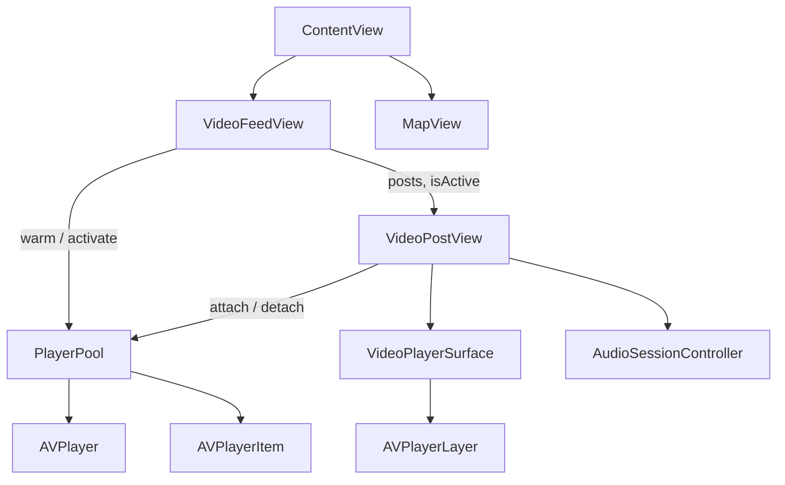

# Marauders

A short-form video feed for iOS, built with SwiftUI and AVFoundation.

The home tab is a vertical, full-screen video feed in the style of TikTok: swipe up
for the next clip, tap to pause, double tap to like. A second tab renders a live
MapKit map with friend locations on top of a Hogwarts-flavoured theme.

## Features

- Vertical paging feed with one video per screen, snapping to the next clip
- Pooled `AVPlayer` instances that preload neighbouring clips and loop seamlessly
- Tap to pause, double tap to like with a heart burst, mute toggle, mute-aware progress bar
- Buffering spinner, failure card with a retry action, and a clean path back to playback
- `AVAudioSession` configured for movie playback, with interruption and route change handling
- MapKit tab with user location, selectable friend annotations and map style switching

## Architecture



| Layer | Type | Responsibility |
| --- | --- | --- |
| `VideoFeedView` | View | Owns the feed state, decides which post is active, preloads a window of three |
| `VideoPostView` | View | Renders one post and translates player callbacks into loading, error and progress UI |
| `PlayerPool` | Plain class | Owns every `AVPlayer`, keyed by URL, with LRU eviction and pin protection |
| `VideoPlayerSurface` | `UIViewRepresentable` | Bridges `AVPlayer` into a view through a custom `AVPlayerLayer` host |
| `AudioSessionController` | Plain class | Single place that configures the shared `AVAudioSession` |

### Playback lifecycle

`PlayerPool` keeps a fixed number of players alive and hands the same instance back for
the same URL every time, so scrolling back to a clip reuses the buffered media instead of
re-downloading the manifest.

- `attach(to:)` pins the player for the lifetime of the cell. Pinned players are never evicted.
- `warm(_:)` pre-creates players for the active post and its immediate neighbours.
- `attach` and `resolve` refresh recency, so the player you are watching is the last one
  the LRU cache would throw away.
- The end-of-item observer only restarts playback if the player was actually playing, which
  stops a detached, preloaded clip from starting to play behind the current one.

## Design decisions

**`AVPlayerLayer` instead of `AVPlayerViewController`.** `AVPlayerViewController` brings its
own transport UI, PiP support and a `UIViewController` lifecycle that has to be re-hosted
inside SwiftUI. A custom `UIView` whose `layerClass` is `AVPlayerLayer` gives a plain SwiftUI
view, keeps the controls ours, and removes the `UIViewControllerRepresentable` hop. The cost is
that PiP, Now Playing info and DRM handling would have to be added back by hand.

**`ScrollView` with `.scrollTargetBehavior(.paging)` instead of a paged `TabView`.** A
`TabView` builds and keeps every page alive, which means every clip in the feed holds a
`VideoPlayerLayer` at once. A `LazyVStack` only materialises the pages near the viewport, and
`.containerRelativeFrame(.vertical)` plus paging gives one clip per screen without a fixed
height assumption.

**No side effects in `body`.** An early version resolved the player from inside `body`, which
mutated the pool during a view update. Player creation moved into `onAppear` / `onDisappear`,
so the view body stays a pure function of its inputs.

**Preloading is a side effect of pooling.** There is no separate preheat step: creating the
`AVPlayerItem` is what starts buffering, so warming the window is enough to hide the
manifest fetch of the next clip.

**Item status is observed, not guessed.** Each cell watches `AVPlayerItem.status` and
`AVPlayerItemFailedToPlayToEndTime`. The KVO callback can arrive off the main thread, so the
state change hops to the main actor before touching `@State`.

## Project layout

```
Marauders-ios/
  Marauders/
    ContentView.swift            Tab container
    MaraudersApp.swift           App entry point
    MapView.swift                MapKit tab
    Friend.swift                 Friend model and sample data
    Feed/
      VideoFeedView.swift        Vertical pager and feed state
      VideoPostView.swift        One post: gestures, overlays, error UI
      VideoPlayerSurface.swift   AVPlayerLayer bridge
      PlayerPool.swift           Player cache, eviction, session events
      AudioSessionController.swift
      VideoPost.swift            Post model and sample feed
  MaraudersTests/
    PlayerPoolTests.swift        Eviction, pinning and cache tests
```

## Requirements

- Xcode 26 or newer
- iOS 26.5 deployment target
- A network connection: the sample feed streams Apple's public HLS test streams

## Running

```sh
open Marauders-ios/Marauders.xcodeproj
```

Pick an iOS simulator and run the `Marauders` scheme.

## Tests

```sh
xcodebuild test \
  -project Marauders-ios/Marauders.xcodeproj \
  -scheme Marauders \
  -destination 'platform=iOS Simulator,name=iPhone 17'
```

The suite covers the parts of the app that are not visual: LRU eviction order, pin protection,
recency refresh, invalidation, mute forwarding, and feed data integrity.

## Roadmap

- Cursor based pagination against a real feed API
- Optimistic like and save with rollback on failure
- Comment sheet, profile tab and search
- Preload tuning based on measured scroll behaviour on device
- Offline cache for the last viewed clips

## Licence

MIT
