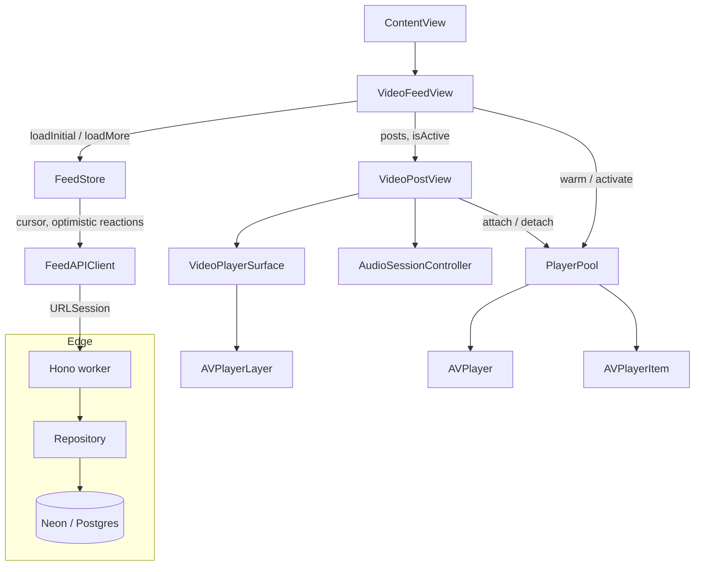

# Marauders

A short-form video feed for iOS with its own API, built with SwiftUI, AVFoundation,
Hono, Cloudflare Workers and Neon (Postgres).

The home tab is a vertical, full-screen video feed in the style of TikTok: swipe up
for the next clip, tap to pause, double tap to like. Likes and saves are written
through to the API optimistically and are scoped per viewer.

## Features

The home screen is the video and nothing else. There is no caption, no action rail and no
tab bar; a clip fills the screen and the only chrome is what playback itself needs.

- Full bleed vertical paging, one clip per screen, snapping to the next
- Landscape clips are shown whole, floating over a blurred, dimmed copy of themselves so a
  16:9 video fills a 19.5:9 screen instead of being cropped to its middle 46 percent
- Tap anywhere to pause, with a play glyph while paused
- Pooled `AVPlayer` instances that preload the neighbouring clips and loop seamlessly
- Buffering spinner and a feed level error state
- A clip that cannot play is skipped instead of shown: the feed jumps to the next playable post,
  pulling another page first if the failure landed on the tail. The failure card stays for
  anyone who scrolls back to a dead post on purpose
- Cursor based pagination that prefetches as the tail comes into view, plus an end of feed marker
- `AVAudioSession` on `.ambient` with `.mixWithOthers`: there is no mute button, so the
  hardware silent switch has to keep working and a clip must never stop other audio.
  The mode is `.default`, not `.moviePlayback`, which `AVAudioSession` only accepts alongside
  the `.playback` category. `PlayerPool` still handles interruptions and route changes

The API already carries likes, saves and comments, and `FeedStore` implements the optimistic
reaction flow, but none of it is on screen yet: playback is the thing being tuned first.

Every seeded post points at a stream that has been verified to actually decode. Two of the
five Apple sample streams that were in use fail with `CoreMediaErrorDomain -16044`, which is
why the feed was skipping its own first post on launch.

## Architecture



| Layer | Type | Responsibility |
| --- | --- | --- |
| `VideoFeedView` | View | Owns the feed state, decides which post is active, preloads a window of three |
| `VideoPostView` | View | One clip: the player surface, tap to pause, and the loading and failure states |
| `FeedStore` | `@Observable` class | Feed state machine: phases, cursor, optimistic reactions and rollback |
| `FeedAPIClient` | Struct | Typed `URLSession` calls, viewer identity and error mapping |
| `PlayerPool` | Plain class | Owns every `AVPlayer`, keyed by URL, with LRU eviction and pin protection |
| `VideoPlayerSurface` | `UIViewRepresentable` | Bridges `AVPlayer` into a view through a custom `AVPlayerLayer` host, with a selectable `videoGravity` |
| `AmbientVideoBackdrop` | `UIViewRepresentable` | Second `AVPlayerLayer` at `.resizeAspectFill` under a `UIVisualEffectView`, used as the blurred backdrop behind a letterboxed clip |
| `AudioSessionController` | Plain class | Single place that configures the shared `AVAudioSession` |
| `repository.ts` | Module | Postgres queries: feed paging, reaction upserts, cursor encoding |
| `neon.ts` | Module | Adapts the Neon HTTP driver to the narrow `SqlClient` the repository talks to |
| `index.ts` | Hono app | Routing, viewer extraction, error handling |

## API

Base URL `http://127.0.0.1:8787`. Every request carries an `X-Viewer-Id` header, which
is what makes the reaction endpoints idempotent.

| Method | Path | Notes |
| --- | --- | --- |
| `GET` | `/api/health` | Liveness plus the seeded post count |
| `GET` | `/api/feed?cursor=&limit=` | Newest first, opaque cursor, `nextCursor` is null on the last page, `limit` defaults to 5 and is capped at 20 |
| `POST` | `/api/posts/:id/like` | Inserts into `post_likes`; increments only when the row is new |
| `DELETE` | `/api/posts/:id/like` | Deletes from `post_likes`; decrements only when a row was removed |
| `POST` | `/api/posts/:id/save` | Same contract for saves |
| `DELETE` | `/api/posts/:id/save` | Same contract for saves |

Reaction responses are authoritative and always include the post's current counters and
the caller's own flags, so the client reconciles instead of guessing:

```json
{ "id": "hogsmeade-welcome", "likes": 128401, "saves": 9820, "isLiked": true, "isSaved": false }
```

Cursor values are base64 encoded sequence numbers. A malformed cursor is treated as the
start of the feed rather than an error.

## Design decisions

**`AVPlayerLayer` instead of `AVPlayerViewController`.** `AVPlayerViewController` brings its
own transport UI, PiP support and a `UIViewController` lifecycle that has to be re-hosted
inside SwiftUI. A custom `UIView` whose `layerClass` is `AVPlayerLayer` gives a plain SwiftUI
view, keeps the controls ours, and removes the `UIViewControllerRepresentable` hop. The cost is
that PiP, Now Playing info and DRM handling would have to be added back by hand.

**`ScrollView` with `.scrollTargetBehavior(.paging)` instead of a paged `TabView`.** A
`TabView` builds and keeps every page alive, which means every clip in the feed holds a
`VideoPlayerLayer` at once. A `LazyVStack` only materialises the pages near the viewport, and
`.containerRelativeFrame(.vertical)` plus paging gives one clip per screen without a fixed
height assumption.

**No side effects in `body`.** An early version resolved the player from inside `body`, which
mutated the pool during a view update. Player creation moved into `onAppear` / `onDisappear`,
so the view body stays a pure function of its inputs.

**Preloading is a side effect of pooling.** There is no separate preheat step: creating the
`AVPlayerItem` is what starts buffering, so warming the window is enough to hide the
manifest fetch of the next clip.

**Item status is observed, not guessed.** Each cell watches `AVPlayerItem.status` and
`AVPlayerItemFailedToPlayToEndTime`. The KVO callback can arrive off the main thread, so the
state change hops to the main actor before touching `@State`.

**Reactions are idempotent per viewer, not toggles.** `POST` means "I like this" and `DELETE`
means "I do not", keyed by `X-Viewer-Id`. Replaying a request cannot double count, which is
what makes the optimistic client safe to retry. The response carries the authoritative
counters so the client never has to increment locally after the round trip. The client keeps
the same split: an explicit "I like this" is dropped when the post is already liked, so
firing it twice can never unlike something.

**Rollback over reconciliation on failure.** A rejected like is restored to the snapshot
taken before the optimistic write, so a dropped connection cannot leave the UI showing a
like that the server never recorded.

**Postgres on Neon, reached over HTTP from the Worker.** The feed is a normal relational
schema, so a managed Postgres fits it better than an edge SQLite store, and the Neon HTTP
driver is a better fit for Workers than a TCP pooler. `DATABASE_URL` is a runtime secret, so
the same code runs locally, in preview and in production with no rebuild.

**A reaction is one statement per intent, inside a transaction.** The counter only moves when
the `post_likes` row actually changes:

```sql
WITH target AS (SELECT id FROM posts WHERE id = $2),
     written AS (INSERT INTO post_likes (viewer_id, post_id)
                 SELECT $1, id FROM target
                 ON CONFLICT DO NOTHING
                 RETURNING 1)
UPDATE posts SET likes = likes + 1
WHERE id IN (SELECT id FROM target) AND EXISTS (SELECT 1 FROM written)
```

Tying the `UPDATE` to `written` is what makes a replayed `POST` a no-op instead of a double
count, and `GREATEST(count - 1, 0)` stops a replayed `DELETE` from driving the counter
negative. The write and the read of the resulting counters are sent as a single
`transaction()` call, because a data-modifying CTE in one statement cannot see the rows the
same statement wrote: the read needs the transaction's next statement to see the new count.
`target` also makes an unknown post a clean no-op instead of a foreign key violation.

## Project layout

```
Marauders-ios/
  Config/Info.plist              ATS exception for local development
  Marauders/
    ContentView.swift            Tab container
    MaraudersApp.swift           App entry point
    Friend.swift                 Friend model and sample data
    Feed/
      VideoFeedView.swift        Feed states, paging container, prefetch trigger
      VideoPostView.swift        One clip: player surface, tap to pause, error UI
      VideoPlayerSurface.swift   AVPlayerLayer bridge and the blurred backdrop
      PlayerPool.swift           Player cache, eviction, session events
      AudioSessionController.swift
      FeedStore.swift            Feed state machine and optimistic reactions
      FeedAPIClient.swift        URLSession client, viewer identity, errors
      VideoPost.swift            Post model and preview fixtures
  MaraudersTests/
    PlayerPoolTests.swift        Eviction, pinning and cache tests
    FeedStoreTests.swift         Pagination and optimistic rollback tests

server/
  src/index.ts                   Hono routes
  src/repository.ts              Postgres queries and cursor codec
  src/neon.ts                    Neon HTTP driver adapter
  src/types.ts                   Bindings and payload contracts
  migrations/0001_init.sql       Schema
  seed.sql                       Sample feed
  scripts/db.mjs                 Applies SQL to Neon without psql
  test/pglite.ts                 In-process Postgres for tests
  test/repository.test.ts        Paging and reaction invariants
  test/api.test.ts               HTTP contract
  .dev.vars.example              Template for the local connection string
  wrangler.toml                  Worker config
```

## Requirements

- Xcode 26 or newer, iOS 26.5 deployment target
- Node 20 or newer for the API
- A Neon database: the free tier is enough, and the connection string is the only credential
- A network connection: the seeded feed streams Apple's public HLS test streams

## Running

Start the API first. Create a Neon project, copy its connection string, then load the schema
and the sample feed:

```sh
cd server
npm install
cp .dev.vars.example .dev.vars      # paste your connection string
npm run db:reset
npm run dev                         # http://127.0.0.1:8787
```

`scripts/db.mjs` applies the SQL through the same Neon HTTP driver the Worker uses, so
migrating needs no `psql` and no local Postgres. `npm run db:reset` reloads the schema and the
sample data; `db:migrate` and `db:seed` run the two files separately. The routes answer
`503 database_not_configured` instead of throwing if `.dev.vars` is missing. Then open the app:

```sh
open Marauders-ios/Marauders.xcodeproj
```

Pick an iOS simulator and run the `Marauders` scheme. The app reads its endpoint from
`AppConfig.apiBaseURL`; point that constant at a deployed Worker URL to run against
`wrangler deploy`, after `npx wrangler secret put DATABASE_URL`. The ATS exception in
`Config/Info.plist` only permits cleartext to local addresses, so a deployed endpoint can stay
on HTTPS.

## Deploying

```sh
cd server
npx wrangler login
npm run deploy
npx wrangler secret put DATABASE_URL     # the same connection string
```

The secret is a runtime binding, so redeploys never bake it into the bundle. To point the app
at the deployed Worker, change `AppConfig.apiBaseURL` to the printed
`https://marauders-api.<subdomain>.workers.dev`.

Rotate the Neon password if the connection string has been shared in a chat, a screenshot or a
commit.

## Tests

```sh
cd server
npm run typecheck
npm test
```

The API tests run against [PGlite](https://pglite.dev), a real Postgres compiled to
WebAssembly, so the actual SQL is executed without a database or a network. The harness
implements the same narrow `SqlClient` interface as the Neon adapter, which keeps the
repository honest about what the driver can do. `repository.test.ts` covers the cursor codec,
paging without gaps or repeats, page size clamping, counter idempotency and viewer isolation.
`api.test.ts` drives the Hono app directly to check status codes, the camelCase payload shape
the iOS client decodes, and the unconfigured-database path.

```sh
xcodebuild test \
  -project Marauders-ios/Marauders.xcodeproj \
  -scheme Marauders \
  -destination 'platform=iOS Simulator,name=iPhone 17'
```

The iOS suite covers the parts of the app that are not visual. `PlayerPoolTests` pins down LRU
eviction order, pin protection, recency refresh, invalidation and mute forwarding.
`FeedStoreTests` drives the store through a `URLProtocol` stub to cover pagination, the
prefetch threshold, the failed-feed phase, optimistic likes, and rollback when the API
rejects a reaction.

## Roadmap

- Auth so viewer identity survives reinstalls
- Comment sheet, profile tab and search
- Preload tuning based on measured scroll behaviour on device
- Offline cache for the last viewed clips
- Move the reaction endpoints to a batched request to cut round trips during fast scrolling

## Licence

MIT
